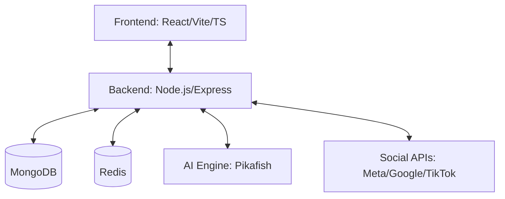

# ♟️ Cờ Tướng Live (Xiangqi Web) 🚀


> Nền tảng chơi cờ tướng online chuyên nghiệp, không quảng cáo, tích hợp AI Pikafish cực mạnh và hệ thống 10,000+ thế cờ đồ sộ.

---

## ✨ Điểm nổi bật (Core Features)

- **🌍 Đa ngôn ngữ (19+ Languages):** Hỗ trợ đầy đủ Tiếng Việt, English, 中文, 日本語, 한국어, v.v...
- **🤖 AI Pikafish Integration:** Công cụ phân tích và thi đấu cấp độ Grandmaster.
- **🛡️ Quality Gate v3.0:** Quy trình CI/CD nghiêm ngặt, đảm bảo độ ổn định 99.9% cho production.
- **📱 Responsive & Cross-platform:** Hoạt động mượt mà trên trình duyệt máy tính và thiết bị di động.
- **📢 Social Automation:** Tự động hóa đăng bài và cập nhật kết quả lên Facebook, TikTok, YouTube.

---

## 🏗️ Cấu trúc Hệ thống (Architecture)



### 📂 Tổ chức mã nguồn
- `/src`: Giao diện người dùng (React components, hooks, stores).
- `/server`: Logic nghiệp vụ, API, Quản lý Bot và Tự động hóa.
- `/public`: Tài nguyên tĩnh (Quân cờ, âm thanh, icon).
- `/docs`: Kho tài liệu kỹ thuật chi tiết.
- `/deploy`: Cấu hình Nginx, PM2 cho môi trường triển khai.

---

## 🚀 Quy trình Phát triển & Triển khai

### 1. Môi trường Local
```bash
npm install          # Cài đặt phụ thuộc
npm run dev          # Khởi chạy Frontend (Port 3000)
npm run server       # Khởi chạy Backend (Port 3001)
```

### 2. Môi trường Dev (Staging)
Mọi thay đổi đẩy lên GitHub sẽ được tự động triển khai tới [dev.cotuong.xyz](https://dev.cotuong.xyz). Hệ thống **Xiangqi Power Gate v3.0** sẽ kiểm tra:
- ✅ SEO Metadata & OG Tags
- ✅ Tốc độ tải trang (Lighthouse Score > 90)
- ✅ Tính toàn vẹn của tệp tĩnh

### 3. Môi trường Production
Chỉ triển khai từ nhánh `production` sau khi đã vượt qua vòng kiểm tra tại môi trường Dev.

---

## 🛡️ Bảo trì & Vận hành

- **Xem Log hệ thống:** `pm2 logs xiangqi-web`
- **Kiểm tra trạng thái:** `pm2 status`
- **Dọn dẹp tài nguyên:** `npm run clean` (Tùy chọn)

---

## 📜 Tài liệu kỹ thuật
- [📘 Hướng dẫn Phát triển](docs/DEVELOPMENT.md)
- [🚢 Quy trình Triển khai chi tiết](docs/DEPLOYMENT.md)
- [🌐 Hệ thống Bản địa hóa (i18n)](docs/i18n-implementation.md)
- [📈 Hệ thống Tính điểm ELO](docs/ELO.md)

---

© 2026 **Cờ Tướng Live**. Tất cả các quyền được bảo lưu.
